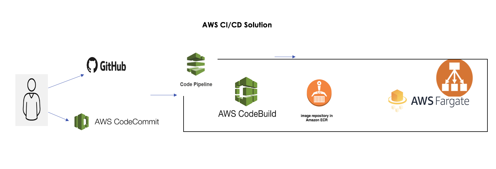

# visitor-application

### Description:
This project will demonstrate how to build and deploy dockerize application into kubernetes cluster (For demo used minikube).

### Dependencies:
To run this project you need to install below componenets in your system.
1. JDK-11
2. Redis server (Docker image should be ok)
3. Docker
4. Minicube
5. kubectl/kubeadm

### To Run Application Locally

1. Stat the redis server.
    * docker run -p 6379:6379 redis
2. Start the application (should have maven locally)
    * mvn clean install
    * mvn spring-boot:run
3. alternatively can run with docker-compose    expose:
      - "6379"
    ports:
      - "6379:6379"

### Build and Push Docker Image:
1. Change to Project location.
2. Run Below commands to build docker image and push to docker hub.
    * docker build -t visitor-app .   (Assuming Dockerfile is in current directory)
    * docker tag visitor-app:latest docker-repo:latest
    * docker push docker-repo:latest
3. Above steps are there in build.sh
4. Run Below command to deploy app into Kubernetes cluster.
    * kubectl create -f visitor-app-deployment.yml (Should have locally minikube/kuberenetes cluster)
5. Execute the below command to test the application after deploying to cluster
    * curl  http://minikube-ip:31200/visitor
    
### CI/CD Work flow:
Used below components to create CI/CD Pipeline.
1. Choose GitHub as a SCM.
2. Created Jenkins Job to automate CI&CD pipeline.
3. Created Docker Hub Repository to hold docker images (Similarly we can push to ACR/ECR).
4. Then deploy to target location it might AWS Fargate/ AWS EKS or Azure Kuberetes services.

### Jenkins Pipeline:

### After successful Jenkins Pipeline run:

### AWS deployment solution
There are different solutions we can build with AWS And Azure. As a example attaching one of the AWS solution.

Note: Not only with the kuberentes we can also deploy the generated images into docker data center (DDC) by having docker-compose file.
